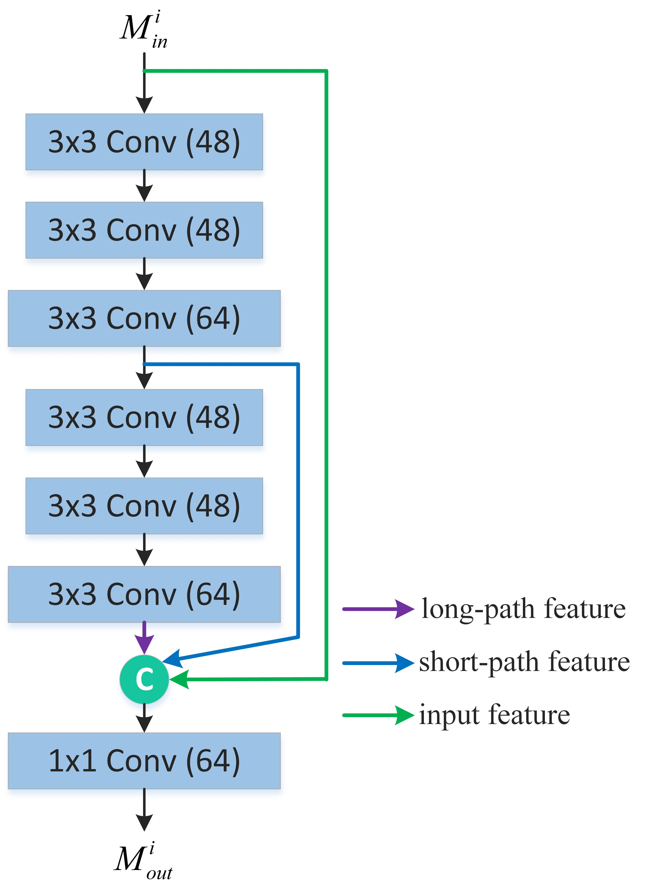
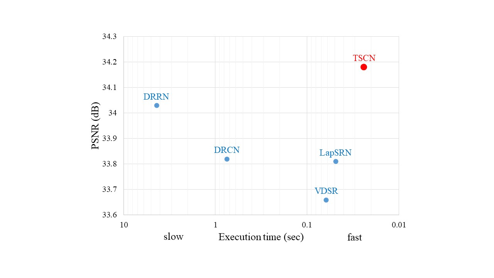

# TSCN <br />
Code of "Two-Stage Convolutional Network for Image Super-Resolution" (To appear in ICPR 2018)

<p align="center">
     <br />
    <em> The schematics of the proposed Two-Stage Convolutional Network. </em>
</p>
<p align="center">
     <br />
    <em> Architecture of the multipath information fusion module. </em>
</p>
<p align="center">
     <br />
    <em> Speed and accuracy trade-off. (x3 on Set5) </em>
</p>

## Run test

* Install Caffe, Matlab R2017a
* Run testing:
```bash
$ cd ./test
$ matlab -nodisplay
>> test_TSCN
```
The training dataset is 291 images.

The results are stored in "results" folder, with both reconstructed images and PSNR/SSIM/IFCs.

## Citation

If you find IDN useful in your research, please consider citing:

```
@inproceedings{Hui-TSCN-2018,
  title={Two-Stage Convolutional Network for Image Super-Resolution},
  author={Hui, Zheng and Wang, Xiumei and Gao, Xinbo},
  booktitle={ICPR},
  year={2018}
}
```
