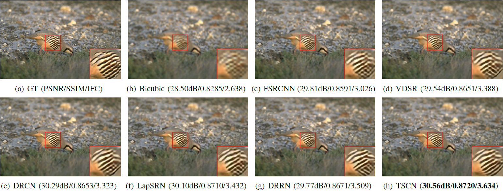

# TSCN <br />
Code of "Two-Stage Convolutional Network for Image Super-Resolution" (ICPR 2018)

[Paper](files/TSCN.pdf)

[Poster](files/icpr18_poster.pdf)

<p align="center">
     <br />
    <em> The schematics of the proposed Two-Stage Convolutional Network. </em>
</p>
<p align="center">
     <br />
    <em> Architecture of the multipath information fusion module. </em>
</p>
<p align="center">
     <br />
    <em> Speed and accuracy trade-off. (x3 on Set5) </em>
</p>

## Run test

* Install Caffe, Matlab R2017a
* Run testing:
```bash
$ cd ./test
$ matlab -nodisplay
>> test_TSCN
```
The training dataset is 291 images.

The results are stored in "results" folder, with both reconstructed images and PSNR/SSIM/IFCs.

## Results
| <sub>Method</sub> | <sub>Scale</sub> | <sub>Set5</sub> | <sub>Set14</sub> | <sub>B100</sub> | <sub>Urban100</sub> |
|:---:|:---:|:---:|:---:|:---:|:---:|
| <sub>DRRN</sub> | <sub>×2</sub> | <sub>37.74/0.9591</sub> | <sub>33.23/0.9136</sub> | <sub>32.05/0.8973</sub> | <sub>31.23/0.9188</sub> |
| <sub>TSCN</sub> | <sub>×2</sub> | <sub>**37.88**/**0.9602**</sub> | <sub>**33.28**/**0.9147**</sub> | <sub>**32.09**/**0.8985**</sub> | <sub>**31.29**/**0.9198**</sub> |
| <sub>DRRN</sub> | <sub>×3</sub> | <sub>34.03/0.9244</sub> | <sub>29.96/0.8349</sub> | <sub>**28.95**/0.8004</sub> | <sub>**27.53**/**0.8378**</sub> |
| <sub>TSCN</sub> | <sub>×3</sub> | <sub>**34.18**/**0.9256**</sub> | <sub>**29.99**/**0.8351**</sub> | <sub>**28.95**/**0.8012**</sub> | <sub>27.46/0.8362</sub> |
| <sub>DRRN</sub> | <sub>×4</sub> | <sub>31.68/0.8888</sub> | <sub>28.21/0.7721</sub> | <sub>27.38/0.7284</sub> | <sub>**25.44**/0.7638</sub> |
| <sub>TSCN</sub> | <sub>×4</sub> | <sub>**31.82**/**0.8907**</sub> | <sub>**28.28**/**0.7734**</sub> | <sub>**27.42**/**0.7301**</sub> | <sub>**25.44**/**0.7644**</sub> |

<p align="center">
    
</p>

## Train
* step 1: Compile Caffe with `train/include/caffe/layers/l1_loss_layer.hpp`, `train/src/caffe/layers/l1_loss_layer.cpp` and `train/src/caffe/layers/l1_loss_layer.cu`
* step 2: Run `data_aug.m` to get the augmented 291 dataset
* step 3: Run `generate_train_TSCN.m` to convert training images to hdf5 file
* step 4: Run `generate_test_TSCN.m` to convert testing images to hdf5 file for valid model during the training phase
* step 5: Run `train.sh` to train ×2 model (Manually create directory `caffemodel_x2`)

#### Note: You can train the stage-one model by run `train_stage_one.sh`

## Citation

If you find TSCN useful in your research, please consider citing:

```
@inproceedings{Hui-TSCN-2018,
  title={Two-Stage Convolutional Network for Image Super-Resolution},
  author={Hui, Zheng and Wang, Xiumei and Gao, Xinbo},
  booktitle={ICPR},
  pages={2670--2675},
  year={2018}
}
```
